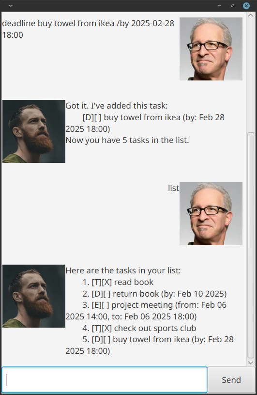

# MaidChan User Guide

```
   __  __       _     _  ____ _
|  \/  | __ _(_) __| |/ ___| |__   __ _ _ __
| |\/| |/ _` | |/ _` | |   | '_ \ / _` | '_ \
| |  | | (_| | | (_| | |___| | | | (_| | | | |
|_|  |_|\__,_|_|\__,_|\____|_| |_|\__,_|_| |_|
```

MaidChan is a chatbot designed to help you manage your tasks and notes quickly through simple text commands. Whether you want to add a new task, mark it as done, or manage your notes, MaidChan understands you.



## Adding Tasks

- **ToDo Task**
  - **Command:** `todo <description>`
  - **Example:** `todo read book`
  - **What It Does:** Creates a basic task.

- **Deadline Task**
  - **Command:** `deadline <description> /by <date>`
  - **Example:** `deadline submit report /by 2021-08-24`
  - **What It Does:** Creates a task with a deadline.

- **Event Task**
  - **Command:** `event <description> /from <start date> /to <end date>`
  - **Example:** `event project meeting /from 2021-08-24 /to 2021-08-29`
  - **What It Does:** Creates a task that spans a time period.

## Listing Tasks

- **Command:** `list`
- **What It Does:** Displays all your current tasks in a numbered list.

## Updating Task Status

- **Mark as Done**
  - **Command:** `mark <task number>`
  - **Example:** `mark 1`
  - **What It Does:** Marks the specified task as completed.

- **Unmark Task**
  - **Command:** `unmark <task number>`
  - **Example:** `unmark 1`
  - **What It Does:** Reverts a marked task to not done.

## Deleting Tasks

- **Command:** `delete <task number>`
- **Example:** `delete 1`
- **What It Does:** Removes the specified task from your list.

## Searching for Tasks

- **Command:** `find <keyword>`
- **Example:** `find book`
- **What It Does:** Searches and lists tasks that contain the keyword.

## Managing Notes

Note: Notes do not persist between runs.

- **Add a Note**
  - **Command:** `addnote <note content>`
  - **Example:** `addnote Buy groceries`
  - **What It Does:** Saves a new note.

- **List Notes**
  - **Command:** `listnote`
  - **What It Does:** Lists all saved notes.

- **Delete a Note**
  - **Command:** `delnote <note number>`
  - **Example:** `delnote 1`
  - **What It Does:** Deletes a note by its number.

## Exiting the Chatbot

- **Command:** `bye`
- **What It Does:** Closes the chatbot session.

## How to Use

1. **Start MaidChan:**
   Download MaidChan from the [releases page](https://github.com/veehz/ip/releases) and run `java -jar maidchan.jar`

2. **Enter Commands:**
   Type your command into the chat input. MaidChan will process your input using the [`Parser.parseCommand`](src/main/java/maidchan/Parser.java) method and execute the relevant action.

3. **Follow Output Instructions:**
   The chatbot's responses will guide you further. For example, if a task number is required for marking or deleting, ensure you see the number in the task list.

4. **Error Feedback:**
   If there is a mistake (e.g., entering an invalid task number), MaidChan returns an error with clear messaging. Commands are case-sensitive—enter commands exactly as shown.

Enjoy using MaidChan to manage your daily tasks and notes efficiently!